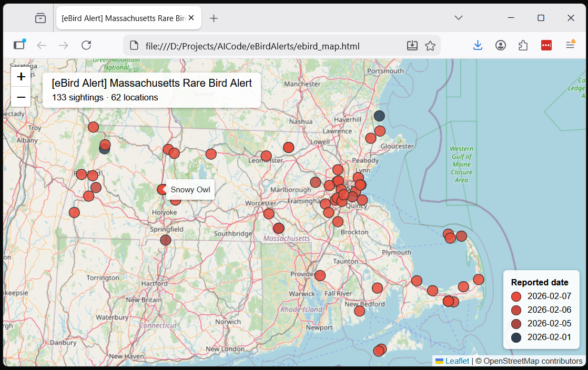
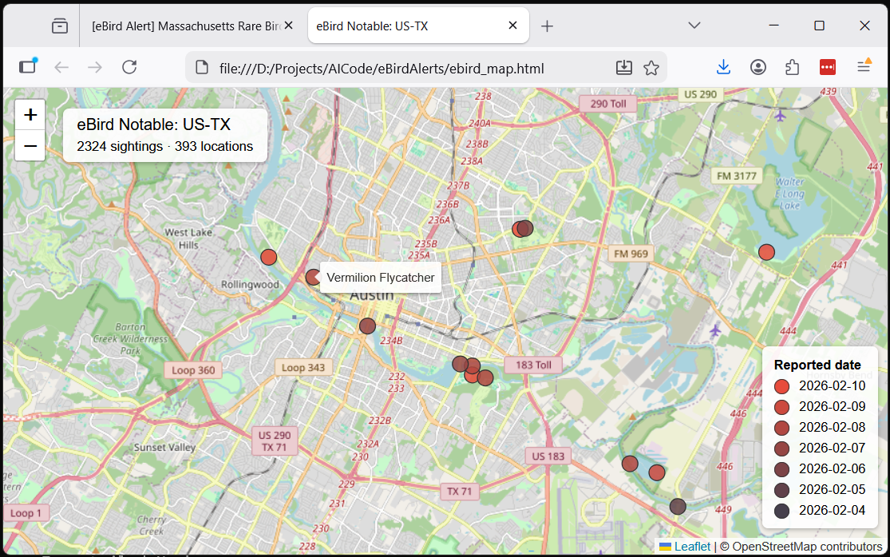

# eBird Alerts Map

Parse eBird Rare Bird Alert emails (.eml) and generate an interactive HTML map with color-coded pins for each sighting.

## Features

- Fetch notable sightings directly from the eBird API by region code
- Aggregates multiple alert emails into a single map
- Color-coded markers: bright red for newest sightings, darkening to blue-grey for oldest
- Grouped pins at shared locations to avoid overlap
- Interactive popups with species, observer, date, comments, and checklist links
- Filterable by state and date range
- Zero Python dependencies — uses only the standard library
- Map rendered with [Leaflet.js](https://leafletjs.com/) via CDN

## Usage

```
python ebird_map.py [path] [options]
```

**Arguments:**

| Argument | Description |
|---|---|
| `path` | Path to an `.eml` file or directory of `.eml` files (default: script directory) |
| `-o`, `--output` | Output HTML file path (default: `ebird_map.html` in the input directory) |
| `-s`, `--state` | Filter sightings to a state (e.g. `Maryland`, `Massachusetts`) |
| `-d`, `--days` | Include the latest N days of emails (default: latest day only) |
| `--no-open` | Don't open the map in the browser automatically |

**Examples:**

```bash
# Map from a single email
python ebird_map.py eBirdAlert-Mass-20260208.eml

# All emails in a directory, last 7 days, Maryland only
python ebird_map.py alerts/ --days 7 --state Maryland

# 30-day view with custom output path
python ebird_map.py alerts/ --days 30 -o my_map.html
```


*Figure 1: Rare Bird Alert Map for Massachusetts*

## Signing Up for eBird Alerts

1. Create a free account at [ebird.org](https://ebird.org) if you don't have one
2. Go to [ebird.org/alerts](https://ebird.org/alerts)
3. Browse available alerts by region (county, state, or country)
4. Click **Subscribe** next to the alert you want
5. Choose **daily** or **hourly** email frequency

**Alert types:**

- **Rare Bird Alerts** — reports of unusual species in a region (past 7 days)
- **ABA Rarities** — nationwide rarities (ABA Codes 3–5) from the US and Canada
- **Needs Alerts** — species you haven't yet reported to eBird for that region

Manage or unsubscribe from alerts at any time on your [My eBird](https://ebird.org/myebird) page.

## Advanced: Fetching Directly from the eBird API

Instead of saving `.eml` files, you can fetch notable sightings directly from eBird using their free API.

### Getting an API Key

1. Log in to your eBird account at [ebird.org](https://ebird.org)
2. Go to [ebird.org/api/keygen](https://ebird.org/api/keygen)
3. Fill in a short reason (e.g. "personal mapping tool") 
4. Read and accept the terms and conditions, then click **Generate Key**
5. Copy the key — it looks like `abc1de2f3gh4`

You can pass the key via `--api-key` or set it as an environment variable:

```bash
# Pass directly
python ebird_map.py --region US-MA-001 --api-key abc1de2f3gh4

# Or set as env var (add to your .bashrc/.zshrc to persist)
export EBIRD_API_KEY=abc1de2f3gh4
python ebird_map.py --region US-MA-001
```

### API Arguments

| Argument | Description |
|---|---|
| `--region` | eBird region code (see below) — triggers API mode |
| `--api-key` | eBird API key (or set `EBIRD_API_KEY` env var) |
| `-d`, `--days` | Days to look back, 1–30 (default: 7). Same flag used for .eml date filtering |

**Examples:**

```bash
# Barnstable County, MA — last 7 days
python ebird_map.py --region US-MA-001

# All of Massachusetts — last 14 days
python ebird_map.py --region US-MA --days 14

# Maryland, filtered to a specific area, custom output
python ebird_map.py --region US-MD --days 30 --state "Baltimore" -o baltimore.html

# All of Texas
python ebird_map.py --region US-TX
```


*Figure 2: Texas Map shown zoomed in on Austin*

### Region Codes

eBird region codes follow a hierarchy: **country** → **state/province** → **county**.

| Level | Format | Example |
|---|---|---|
| Country | `XX` | `US`, `CA`, `MX`, `GB` |
| State/Province | `XX-YY` | `US-MA`, `US-CA`, `CA-ON` |
| County | `XX-YY-ZZZ` | `US-MA-001`, `US-MD-003` |

**Massachusetts counties:**

| Code | County | Code | County |
|---|---|---|---|
| `US-MA-001` | Barnstable | `US-MA-015` | Hampshire |
| `US-MA-003` | Berkshire | `US-MA-017` | Middlesex |
| `US-MA-005` | Bristol | `US-MA-019` | Nantucket |
| `US-MA-007` | Dukes | `US-MA-021` | Norfolk |
| `US-MA-009` | Essex | `US-MA-023` | Plymouth |
| `US-MA-011` | Franklin | `US-MA-025` | Suffolk |
| `US-MA-013` | Hampden | `US-MA-027` | Worcester |

County codes use FIPS numbers. To find codes for any region, browse [ebird.org/alerts](https://ebird.org/alerts) or query the API:

```
https://api.ebird.org/v2/ref/region/list/subnational2/US-MA
```

Replace `subnational2` with `subnational1` for states, or `country` for countries. Replace `US-MA` with the parent region.

## Setup

1. Save eBird alert emails as `.eml` files into a directory (e.g. `alerts/`)
2. Run the script
3. The map opens in your default browser
